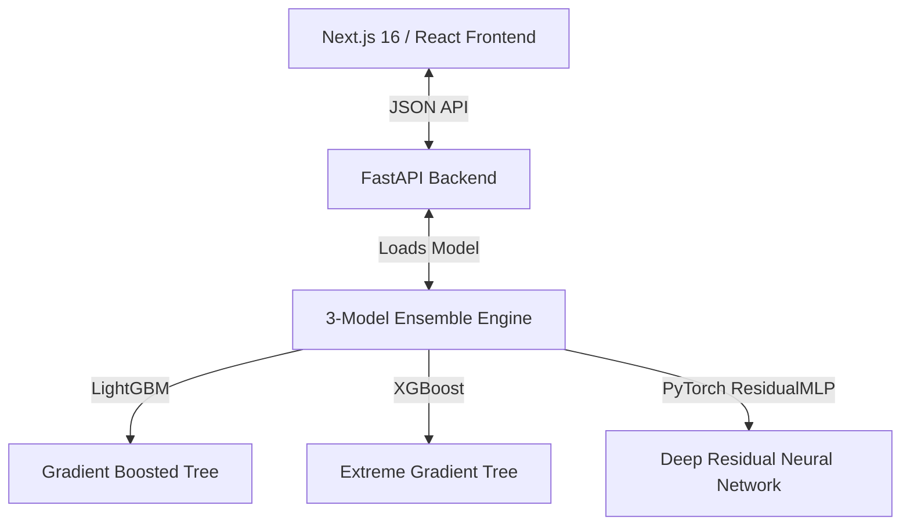

# 🚦 Nivaaran.ai — Event-Driven Congestion Predictive Dispatch Engine

Nivaaran.ai is an intelligent traffic command and resource orchestration system designed for high-density metropolitan networks like Bengaluru. It proactively forecasts traffic congestion surges caused by urban incidents (both planned events like IPL matches and unplanned breakdowns) and translates predictions into automated dispatch directives.

---

## 🛠️ Tech Stack & Architecture

Nivaaran.ai is structured as a modern decoupled web application:



- **Frontend**: Next.js 16 (React, Tailwind CSS, Lucide React icons) — Sleek, light-mode, premium editorial minimalist layout.
- **Backend API**: FastAPI (Python) — Fast REST API endpoint for real-time model inferences and metadata telemetry.
- **Machine Learning**: LightGBM, XGBoost, and PyTorch (Deep Residual MLP).
- **Core Algorithms**: DBSCAN clustering for spatial hotspot identification.

---

## 🧠 Machine Learning & Ensemble Formulation

Rather than relying on simple heuristics, Nivaaran.ai runs a **3-model machine learning ensemble** to predict the **Congestion Surge Index (%)** within seconds of an incident log.

### 1. Model Components
1. **LightGBM Regressor (50% weight)**: Fast, leaf-wise tree growth optimized for categorical proximity features.
2. **XGBoost Regressor (30% weight)**: Depth-wise tree growth to capture high-order feature interactions.
3. **PyTorch Residual MLP (20% weight)**: Deep neural network with residual connections, layer normalization, and SiLU activations to fit highly non-linear residuals.

### 2. Ensemble Equation
The predicted surge index $\hat{y}$ is formulated as:
$$\hat{y} = 0.50 \cdot f_{\text{LightGBM}}(x) + 0.30 \cdot f_{\text{XGBoost}}(x) + 0.20 \cdot f_{\text{PyTorch}}(x)$$

### 3. Feature Engineering Pipeline
To prevent data leakage, categorical features are encoded using **Out-of-Fold (OOF) Target Encoding**. The engine dynamically computes:
- **Asset Proximity**: Haversine distance to the nearest metro station, commercial hub, and critical intersection.
- **Vulnerability Tiers**: Traffic susceptibility weights allocated to corridors (e.g., ORR, Mysore Road).
- **Recurrence Index**: Spatio-temporal event occurrence counts grouped by cause type.
- **Overlap Density**: Overlap count of active incidents within a $300\text{m}$ spatial radius.

---

## 🧭 System Component Directory

```
├── api/
│   ├── main.py              # FastAPI REST endpoints & model cache
│   └── requirements.txt     # Python backend dependencies
├── frontend/
│   ├── src/app/             # Next.js pages (dashboard, predict, map, model, insights)
│   ├── src/components/      # Reusable components (Navbar, FilterSidebar, SVG Vector Map)
│   └── package.json         # React Node dependencies
├── app.py                   # Original Streamlit dashboard (HF Spaces fallback)
├── backend_engine.py        # Haversine proximity & feature engineering pipeline
├── regression_models.py     # ML training script & ResidualMLP PyTorch model
├── dispatch_solver.py       # Rule-based manpower & cone allocation solver
└── hotspot_clustering.py    # DBSCAN clustering algorithm for centroids
```

---

## 🚀 Installation & Local Setup

### Prerequisite
Ensure you have **Python 3.10+** and **Node.js 18+** installed.

### 1. Start the Python Backend API
1. Navigate to the `api` folder or the root directory.
2. Install Python dependencies:
   ```bash
   pip install -r requirements.txt
   ```
3. Run the FastAPI server:
   ```bash
   python api/main.py
   ```
   The backend will start listening on `http://127.0.0.1:8000`.

### 2. Start the Next.js Frontend
1. Navigate to the `frontend` directory:
   ```bash
   cd frontend
   ```
2. Install Node packages:
   ```bash
   npm install
   ```
3. Start the dev server:
   ```bash
   npm run dev
   ```
   Open `http://localhost:3000` in your browser.

